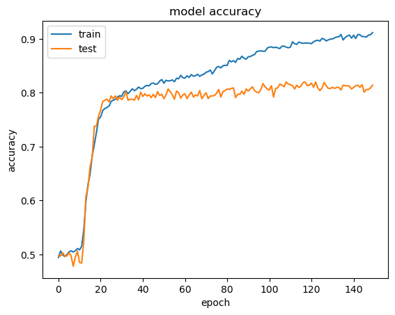

# ChatBot

This project implements Natural Language Processing to attempt at recognizing text from a given set of inputs and predict the reasonable answer according to them. It is based on the course [NLP - Natural Language Processing with Python by Jose Portilla](https://www.udemy.com/course/nlp-natural-language-processing-with-python/).

It uses the susbet of **Babi Data Set from Facebook Research** which can be freely accessed at [https://research.fb.com/downloads/babi/](https://research.fb.com/downloads/babi/).

It is also based on the papers :
- ["Towards AI-Complete Question Answering: A Set of Prerequisite Toy Tasks"](http://arxiv.org/abs/1502.05698.pdf) by *Jason Weston, Antoine Bordes, Sumit Chopra, Tomas Mikolov, Alexander M. Rush*
- ["End-To-End Memory Networks"](http://arxiv.org/abs/1503.08895.pdf) by *Sainbayar Sukhbaatar, Arthur Szlam, Jason Weston, Rob Fergus*

The code is stored in the file `Chat Bot.ipynb` and the data is stored as `train_qa` and `test_qa` in the `data` folder. The trained model is stored as `chatbot.h5` in the `model` folder.

The accuracy for the training set is **~90%** and the validation accuracy is **~80%**.

The training history was also plotted and the plot is given below : 

